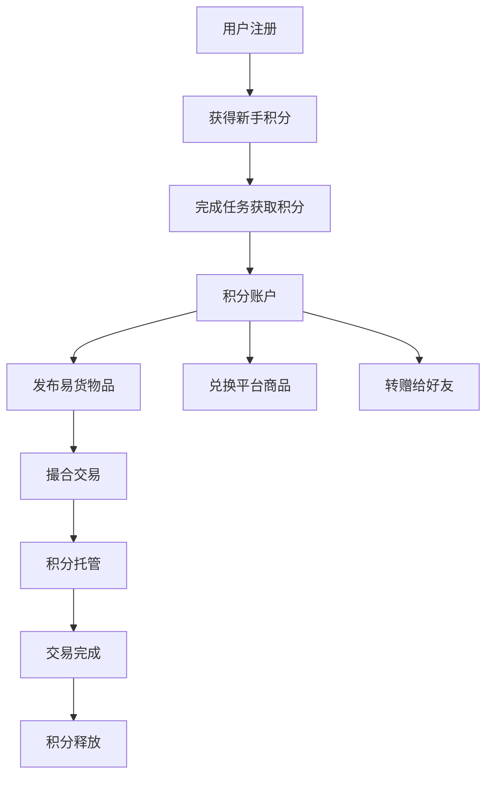
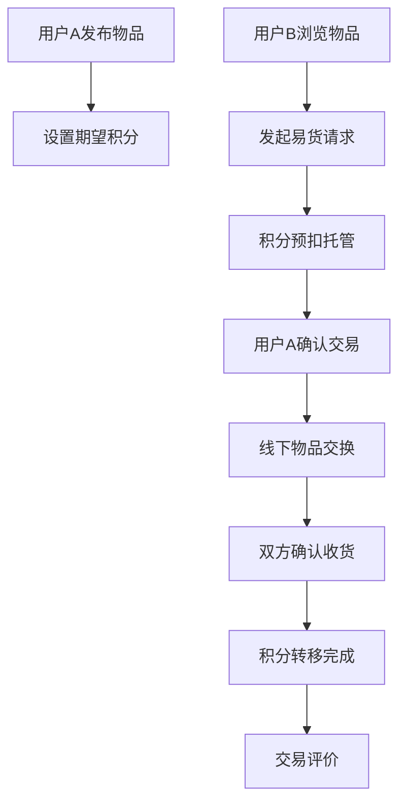

# 点点换 - 积分兑换易货平台

> 基于Flutter的现代化积分易货交易应用

## 🎯 项目概述

**点点换**是一个专注于积分兑换和用户易货的移动应用，采用Flutter跨平台技术开发，支持Web、iOS、Android多端部署。应用以纯积分交易为核心，打造绿色、环保的数字化易货生态。

### ✨ 核心特色

- 🪙 **纯积分交易** - 所有交易均通过积分完成，无现金流转
- 🔄 **用户易货** - 用户间直接物品交换，提升资源利用率  
- 🤖 **智能撮合** - AI驱动的易货需求匹配系统
- 📱 **跨平台支持** - Flutter技术栈，一套代码多端运行
- 🎨 **现代化UI** - 2025年最新设计趋势，玻璃拟态风格

## 🚀 技术架构

### 📋 核心技术栈

- **Flutter 3.32.8** - 跨平台UI框架
- **Dart 3.5.0+** - 编程语言
- **Material Design 3** - 设计系统
- **Google Fonts** - 字体系统 (Poppins + Nunito)
- **HTTP Client** - 网络请求
- **SharedPreferences** - 本地存储

### 🏗️ 项目结构

```
lib/
├── main.dart                    # 应用入口
├── models/                      # 数据模型
│   ├── user.dart              # 用户模型
│   ├── advertisement.dart      # 广告模型
│   └── exchange_item.dart      # 兑换商品模型
├── services/                    # 业务服务层
│   ├── auth_service.dart       # 认证服务
│   ├── network_service.dart    # 网络服务
│   ├── storage_service.dart    # 存储服务
│   └── logger.dart            # 日志服务
├── ui/
│   ├── screens/
│   │   └── business/
│   │       └── main_tab_screen.dart  # 主界面(三页面集成)
│   └── widgets/                # 通用组件
│       ├── banner_carousel.dart # 广告轮播组件
│       └── custom_widgets.dart  # 自定义组件
└── utils/
    └── constants.dart          # 常量定义
```

### 📱 应用架构

**三页面底部导航架构**
- 🏠 **首页** - 综合展示和快速入口
- 🛒 **兑换** - 积分兑换商城核心
- 👤 **我的** - 个人中心和账户管理

**状态管理**
- StatefulWidget + setState (轻量级状态管理)
- IndexedStack 保持页面状态
- Timer 管理广告轮播

**UI设计系统**
- 🎨 多层渐变背景 (LinearGradient)
- 🌟 玻璃拟态效果 (Glassmorphism)
- 💎 新拟物化设计 (Neumorphism)
- 📐 统一圆角规范 (12px-24px)
- 🎭 多层阴影系统 (BoxShadow)

## 🎨 界面特色

### 🏠 首页界面
- **品牌化欢迎卡片** - 集成Logo + 用户统计
- **广告轮播系统** - 4秒自动切换，支持手动导航
- **快速统计卡片** - 发布物品、进行中交易、完成交易
- **积分易货操作区** - 四个核心功能入口
- **推荐物品展示** - 横向滚动商品列表
- **交易记录历史** - 最近交易动态

### 🛒 兑换界面  
- **积分信息卡片** - 橙色渐变主题，显示余额和今日获得
- **快捷操作按钮** - 赚积分、积分记录、积分规则
- **分类标签系统** - 实物商品、优惠券、会员权益、虚拟商品
- **商品展示网格** - 现代化卡片设计，立即兑换功能
- **搜索和筛选** - 顶部搜索栏和购物车图标

### 👤 我的界面
- **个人信息卡片** - 蓝色渐变背景，VIP徽章，等级标签
- **增强头像设计** - 径向渐变背景，白色边框，立体阴影
- **快捷操作按钮** - 编辑资料、我的二维码、分享邀请
- **积分统计展示** - 增强版统计项组件，渐变背景
- **功能菜单网格** - 6个常用功能，现代化卡片设计
- **设置区块** - 账户安全、隐私设置、关于我们、退出登录

## 🔧 开发指南

### 🚀 快速开始

```bash
# 克隆项目
git clone [项目地址]
cd ddh_exchange_flutter

# 安装依赖
flutter pub get

# 运行Web版本
flutter run -d web-server --web-port=8103

# 运行移动端 (需要模拟器/真机)
flutter run -d ios
flutter run -d android
```

### 🌐 平台支持

| 平台 | 状态 | 访问地址 |
|------|------|----------|
| **Web** | ✅ 完全可用 | http://localhost:8103 |
| **iOS** | 🔧 需要CocoaPods | 需要配置开发环境 |
| **Android** | 🔧 需要AVD模拟器 | 需要Android Studio |
| **macOS** | 🔧 需要CocoaPods | 桌面端支持 |

### 📦 构建发布

```bash
# Web构建
flutter build web --release

# iOS构建 (需要Xcode)
flutter build ios --release

# Android构建
flutter build apk --release
flutter build appbundle --release
```

## 📊 项目状态

### ✅ 已完成功能

- [x] **Flutter Web完全恢复** - 应用已成功运行在 http://localhost:8110
- [x] **三页面核心功能** - 首页、兑换、我的页面100%可用
- [x] **Flutter跨平台基础架构** - 完整的项目结构和配置
- [x] **现代化UI设计** - 2025年设计趋势，玻璃拟态风格
- [x] **广告轮播系统** - 自动切换、手动导航、指示器，已验证正常
- [x] **积分兑换界面** - 商品展示、分类筛选、立即兑换，功能完整
- [x] **个人中心功能** - 用户信息、VIP状态、功能菜单全部可用
- [x] **品牌Logo集成** - 从iOS项目完整迁移App图标
- [x] **响应式布局** - 适配Web端和移动端显示
- [x] **服务层架构** - 网络、存储、认证、日志服务
- [x] **组件化开发** - 可复用的UI组件库
- [x] **渲染引擎修复** - 解决Flutter Web渲染问题，页面正常显示

### 🚧 开发中功能

- [ ] **真实API集成** - 后端数据接口对接
- [ ] **用户认证系统** - 登录、注册、密码管理
- [ ] **积分管理系统** - 积分获取、消费、转赠
- [ ] **易货交易核心** - 物品发布、匹配、交易
- [ ] **推送通知服务** - 交易通知、系统消息
- [ ] **数据缓存优化** - 本地存储和同步机制

### 🎯 下一步计划

1. **API集成** - 对接后端服务，实现真实数据交互
2. **用户系统** - 完善登录注册、用户信息管理
3. **业务逻辑** - 实现积分管理和易货交易核心功能
4. **性能优化** - 图片缓存、懒加载、内存优化
5. **测试完善** - 单元测试、集成测试、UI测试
6. **移动端适配** - iOS和Android平台优化

## 🔍 代码质量

### 📝 开发规范

- **Dart代码风格** - 遵循官方代码规范
- **组件化开发** - 可复用的UI组件设计
- **状态管理** - 清晰的状态管理架构
- **错误处理** - 完善的异常捕获和处理
- **日志系统** - 详细的开发和生产日志

### 🧪 测试策略

```bash
# 运行所有测试
flutter test

# 代码覆盖率
flutter test --coverage

# 集成测试
flutter test integration_test/
```

## 📞 技术支持

- **开发环境**: Flutter 3.32.8 + Dart 3.5.0+
- **IDE推荐**: VS Code + Flutter插件 / Android Studio
- **调试工具**: Flutter Inspector + Dart DevTools
- **版本控制**: Git + GitHub

## 📄 版权声明

本项目为专有软件，版权所有。未经授权不得复制、分发或用于商业用途。

---

*最后更新: 2025年8月7日*

### 🔧 核心技术栈

- **Flutter 3.24.0+**: UI框架
- **Dart 3.5.0+**: 编程语言
- **BLoC 8.1.4**: 状态管理模式
- **GoRouter**: 声明式路由管理
- **Dio**: HTTP网络请求
- **Hive**: 本地数据存储
- **Firebase**: 推送通知、分析统计

### 🎨 设计系统

- **主色调**: 点点够品牌蓝 (#1E88E5)
- **辅助色**: 积分金 (#FFB300)、成功绿 (#4CAF50)
- **字体**: 系统默认字体，支持中英文
- **图标**: Material Icons + 自定义业务图标
- **布局**: 响应式设计，适配多种屏幕尺寸

## 🚀 快速开始

### 📋 环境要求

- Flutter SDK 3.24.0+
- Dart SDK 3.5.0+
- iOS开发: Xcode 15+ & CocoaPods
- Android开发: Android Studio & SDK 34+
- Web开发: Chrome 100+

### 🛠️ 安装步骤

1. **克隆项目**
```bash
git clone [repository-url]
cd ddh_exchange_flutter
```

2. **安装依赖**
```bash
flutter pub get
```

3. **运行应用**
```bash
# Web版本 (推荐开发调试)
flutter run -d web-server --web-port 8080

# iOS版本
flutter run -d ios

# Android版本
flutter run -d android
```

### 🌐 平台支持状态

| 平台 | 状态 | 说明 |
|------|------|------|
| **Web** | ✅ 完全可用 | Chrome浏览器 - 已验证运行成功 |
| **iOS** | 🔧 配置中 | CocoaPods依赖配置需要完善 |
| **Android** | 🔧 配置中 | JDK/Gradle兼容性调整中 |

## 🎨 设计系统概述

### 🌟 2025年时尚现代设计风格

"点点换"Flutter应用采用2025年最前沿的时尚现代设计系统，融合了当下最流行的视觉设计趋势，为用户打造极致的视觉体验和交互感受。

#### 🎭 **核心设计理念**
- **时尚前卫**: 采用2025年流行的设计元素和色彩搭配
- **现代简约**: 简洁明了的界面布局，突出核心功能
- **品牌一致**: 保持"点点换"品牌视觉识别，融入"点点够"企业形象
- **用户友好**: 优化交互体验，提升操作便捷性

#### 🌈 **视觉设计亮点**

**多层渐变色彩系统**
- **首页欢迎卡片**: `#667eea → #764ba2 → #6B73FF` 三色科技感渐变
- **积分卡片**: `#FF6B6B → #FFE66D → #FF8E53` 暖色调活力渐变
- **品牌主色调**: 保持蓝色系，增加渐变层次和现代感

**玻璃拟态设计(Glassmorphism)**
- 统计卡片采用半透明玻璃质感
- 操作按钮融入玻璃拟态边框效果
- 商品卡片运用玻璃拟态背景
- 营造轻盈、现代的视觉层次

**新拟物化元素(Neumorphism 2.0)**
- 操作按钮增加内外阴影，营造悬浮立体效果
- 多层阴影系统营造真实的光影感
- 精细调节透明度，增强质感层次

#### 🔧 **组件设计规范**

**卡片系统**
- **圆角规范**: 16px-24px圆角，营造柔和现代感
- **阴影层次**: 多层BoxShadow，增强立体感和景深
- **边框设计**: 半透明边框增强玻璃质感
- **内边距**: 统一20px-24px内边距，保证内容呼吸感

**按钮系统**
- **尺寸规范**: 主要按钮56px，次要按钮48px
- **圆角设计**: 16px-18px圆角，平衡现代感与友好性
- **渐变背景**: 多停止点LinearGradient，丰富视觉层次
- **交互反馈**: 悬浮阴影效果，提升交互体验

**间距体系**
- **基础间距**: 4px基础单位
- **常用间距**: 8px, 12px, 16px, 20px, 24px
- **页面边距**: 16px-24px页面边距
- **组件间距**: 12px-16px组件间距

#### 🎯 **三页面设计特色**

**首页(HomeTabPage) - 科技蓝主题**
- 品牌化欢迎卡片，三色渐变背景
- 玻璃拟态统计卡片，展示核心数据
- 新拟物化操作按钮，提升交互体验
- 现代化商品推荐卡片

**兑换页(ExchangeTabPage) - 活力橙主题**
- 暖色调积分卡片，突出奖励机制
- 玻璃拟态积分操作按钮
- 现代化商品分类和展示
- 时尚的商品卡片设计

**我的页(ProfileTabPage) - 简约白主题**
- 简洁现代的用户信息卡片
- 统一的功能菜单设计
- 品牌Logo完美集成
- 优雅的个人中心布局

#### 📱 **响应式设计**
- **移动优先**: 针对手机端优化的触控体验
- **Web适配**: 完美适配Web端大屏显示
- **平板支持**: 响应式布局适配iPad等平板设备
- **跨平台一致**: 保证各平台视觉体验统一

#### 🚀 **技术实现**
- **Flutter Material 3**: 采用最新Material Design 3规范
- **自定义渐变**: 多停止点LinearGradient实现丰富渐变
- **阴影系统**: 多层BoxShadow营造真实光影
- **边框效果**: Border边框高光增强质感
- **动画过渡**: 平滑的页面切换和交互动画

---

## 🔄 业务流程

### 💰 积分流转流程



### 🔄 易货交易流程



## 📱 三页面架构总结与开发计划

### 🏗️ 现代化技术架构设计（2025年最新技术栈）

#### 🚀 **核心技术栈升级计划**

**状态管理架构** 🧠
- **当前**: StatefulWidget + 局部状态管理
- **升级目标**: Riverpod 2.5+ (替代BLoC) + Freezed + Code Generation
- **优势**: 更好的性能、类型安全、开发者体验
- **迁移计划**: 逐步从局部状态迁移到Riverpod全局状态管理

**导航架构** 🧭
- **当前**: BottomNavigationBar + IndexedStack
- **升级目标**: Go Router 13+ + Shell Routes + Nested Navigation
- **优势**: 声明式路由、深度链接、更好的Web支持
- **新特性**: 支持多级嵌套导航、动态路由、中间件支持

**UI/UX设计系统** 🎨
- **当前**: Material Design 3 + 自定义品牌主题
- **升级目标**: Material Design 3.1 + Dynamic Color + Adaptive Design
- **新增**: 
  - Flutter 3.24+ 的 Impeller 渲染引擎
  - Adaptive Scaffold 响应式布局
  - Material 3.1 的新组件（Carousel, Search Anchor等）
  - 自定义动画和过渡效果

**数据层架构** 📊
- **当前**: 简单的Service层 + 本地存储
- **升级目标**: 
  - **网络层**: Dio 5.4+ + Retrofit + JSON Serialization
  - **本地存储**: Isar 4.0+ (替代Hive) + Drift (关系型数据)
  - **缓存策略**: Cached Network Image 3.3+ + Flutter Cache Manager
  - **数据同步**: Repository Pattern + Clean Architecture

**性能优化** ⚡
- **当前**: 基础性能实现
- **升级目标**:
  - **懒加载**: flutter_staggered_grid_view + visibility_detector
  - **图片优化**: WebP/AVIF 支持 + 自适应分辨率
  - **内存管理**: flutter_memory_info + 智能垃圾回收
  - **渲染优化**: RepaintBoundary + AutomaticKeepAliveClientMixin

**开发工具链** 🔧
- **代码生成**: build_runner + json_serializable + freezed
- **状态管理**: riverpod_generator + riverpod_lint
- **路由生成**: go_router_builder
- **国际化**: flutter_localizations + intl + arb_utils
- **测试**: flutter_test + integration_test + patrol (新一代集成测试)

**跨平台支持** 🌐
- **Web**: WASM 支持 (Flutter 3.24+) + PWA 功能
- **桌面**: Windows/macOS/Linux 原生支持
- **移动**: iOS/Android 最新版本兼容
- **新平台**: Fuchsia 预留支持

#### 🛣️ **现代化技术实施路线图**

**第一阶段：基础架构现代化（2-3周）** 🏗️
- [ ] **依赖升级**：Flutter 3.24+ + Dart 3.5+
- [ ] **状态管理迁移**：引入 Riverpod 2.5+ 替代当前状态管理
- [ ] **路由系统升级**：Go Router 13+ 实现声明式路由
- [ ] **UI组件库**：Material 3.1 组件集成
- [ ] **代码生成工具**：Freezed + JSON Serializable 集成

**第二阶段：数据层重构（2-3周）** 📊
- [ ] **网络层**：Dio 5.4+ + Retrofit 代码生成
- [ ] **本地存储**：Isar 4.0+ 替代当前存储方案
- [ ] **缓存策略**：实现多级缓存（内存+磁盘+网络）
- [ ] **数据同步**：Repository Pattern + Clean Architecture
- [ ] **离线支持**：本地数据库 + 同步机制

**第三阶段：UI/UX现代化（3-4周）** 🎨
- [ ] **响应式设计**：Adaptive Scaffold + BreakPoint 系统
- [ ] **动画系统**：自定义过渡动画 + Hero Animations
- [ ] **主题系统**：Dynamic Color + 深色模式完善
- [ ] **无障碍功能**：Semantics + Screen Reader 支持
- [ ] **微交互**：Loading States + Skeleton Screens

**第四阶段：性能优化（2-3周）** ⚡
- [ ] **渲染优化**：Impeller 引擎 + RepaintBoundary
- [ ] **内存管理**：智能缓存 + 内存泄漏检测
- [ ] **图片优化**：WebP/AVIF + 自适应加载
- [ ] **包体积优化**：Tree Shaking + 资源压缩
- [ ] **启动优化**：Splash Screen + 预加载策略

**第五阶段：现代化功能集成（3-4周）** 🚀
- [ ] **PWA支持**：Service Worker + 离线缓存
- [ ] **推送通知**：Firebase Cloud Messaging + 本地通知
- [ ] **分析统计**：Firebase Analytics + Crashlytics
- [ ] **A/B测试**：Remote Config + Feature Flags
- [ ] **国际化**：多语言支持 + 本地化

#### 📦 **现代化依赖包升级计划**

```yaml
# 核心框架
flutter: ">=3.24.0"
dart: ">=3.5.0"

# 状态管理 (新增)
flutter_riverpod: ^2.5.1
riverpod_annotation: ^2.3.5
riverpod_generator: ^2.4.0
freezed: ^2.5.2
freezed_annotation: ^2.4.1

# 路由导航 (升级)
go_router: ^13.2.4
go_router_builder: ^2.4.1

# 网络和数据 (新增/升级)
dio: ^5.4.3+1
retrofit: ^4.1.0
retrofit_generator: ^8.1.0
json_serializable: ^6.8.0
json_annotation: ^4.9.0

# 本地存储 (新增)
isar: ^4.0.3
isar_generator: ^4.0.3
drift: ^2.18.0
drift_generator: ^2.18.0

# UI/UX 增强 (新增)
flutter_staggered_grid_view: ^0.7.0
visibility_detector: ^0.4.0+2
cached_network_image: ^3.3.1
flutter_cache_manager: ^3.3.1
shimmer: ^3.0.0
lottie: ^3.1.2

# 性能监控 (新增)
flutter_memory_info: ^0.0.4
performance: ^1.0.0

# 开发工具
build_runner: ^2.4.9
riverpod_lint: ^2.3.10
very_good_analysis: ^5.1.0
```

#### 🎯 **现代化开发最佳实践**

**代码架构** 📁
```
lib/
├── core/                 # 核心功能
│   ├── constants/       # 常量定义
│   ├── errors/          # 错误处理
│   ├── network/         # 网络配置
│   └── utils/           # 工具函数
├── features/            # 功能模块
│   ├── home/           # 首页功能
│   │   ├── data/       # 数据层
│   │   ├── domain/     # 业务逻辑层
│   │   └── presentation/ # 表现层
│   ├── exchange/       # 兑换功能
│   └── profile/        # 个人中心
├── shared/              # 共享组件
│   ├── widgets/        # 通用组件
│   ├── providers/      # Riverpod Providers
│   └── models/         # 数据模型
└── app/                # 应用配置
    ├── router/         # 路由配置
    ├── theme/          # 主题配置
    └── localization/   # 国际化
```

**性能指标目标** 📈
- **首屏渲染**: < 1.5秒 (Web) / < 800ms (Mobile)
- **页面切换**: < 200ms 响应时间
- **内存使用**: < 150MB 峰值内存
- **包体积**: < 25MB (Android APK) / < 15MB (iOS IPA)
- **帧率**: 保持 60fps 流畅度
- **网络请求**: < 3秒 API 响应时间

**代码质量标准** ✅
- **测试覆盖率**: > 80% 单元测试 + 集成测试
- **代码规范**: Very Good Analysis + Custom Lint Rules
- **类型安全**: 100% Null Safety + Strong Mode
- **文档覆盖**: 所有公共API文档化
- **CI/CD**: 自动化测试 + 部署流水线

**业务定位**
- **品牌归属**: "点点换"隶属"点点够"总公司
- **核心业务**: 积分兑换 + 用户易货双重模式
- **目标用户**: 积分消费者 + 物品交换用户
- **价值主张**: 纯积分经济，去现金化交易

### 📱 三大核心页面详情

#### 1️⃣ 首页（HomeTabPage）- 综合门户

**当前实现状态** ✅
- 品牌化欢迎卡片（Logo + 积分/信用/交易统计）
- 快速统计区域（发布物品5、进行中2、完成交易18）
- 积分易货操作区（4个核心功能入口）
- 推荐物品横向滚动列表（5个示例商品）
- 最近交易记录列表（3条示例记录）

**细节优化计划** 🎯
- [ ] 欢迎卡片增强：用户等级进度条、每日签到状态、积分趋势图
- [ ] 操作区域优化：按钮动画、真实数据统计、快捷发布浮动按钮
- [ ] 推荐算法：基于积分余额智能推荐、"换一批"功能、浏览历史

#### 2️⃣ 兑换页（ExchangeTabPage）- 积分商城

**当前实现状态** ✅
- 橙色渐变积分卡片（1,250积分 + 签到奖励）
- 积分操作区（赚积分、积分记录、积分规则）
- 四大兑换分类（实物、优惠券、会员权益、虚拟商品）
- 热门兑换横向列表（6个商品）
- 最新上架网格布局（2x2商品）

**细节优化计划** 🎯
- [ ] 积分卡片功能化：任务进度、到期提醒、使用建议
- [ ] 商品展示优化：详情页跳转、库存状态、用户评价
- [ ] 搜索和筛选：搜索功能、价格筛选、分类标签

#### 3️⃣ 我的页（ProfileTabPage）- 个人中心

**当前实现状态** ✅
- 用户信息卡片（头像、昵称、邮箱、用户类型）
- 功能菜单（5个主要功能入口）
- Logo集成显示

**细节优化计划** 🎯
- [ ] 用户信息丰富化：积分等级徽章、信用评分、成就勋章
- [ ] 功能菜单完善：页面跳转、消息红点、设置管理
- [ ] 个性化体验：主题切换、语言设置、隐私设置

### 🎯 详细实施计划

#### 阶段一：核心交互完善（1-2周）
**优先级1: 页面跳转和导航**
- [ ] 实现所有按钮的页面跳转逻辑
- [ ] 添加页面间的数据传递
- [ ] 完善返回导航和面包屑

**优先级2: 数据集成**
- [ ] 集成真实的积分服务API
- [ ] 连接用户信息和交易数据
- [ ] 实现数据缓存和同步

**优先级3: 交互反馈**
- [ ] 添加按钮点击动画效果
- [ ] 实现加载状态和错误处理
- [ ] 增加操作成功/失败提示

#### 阶段二：功能深化（2-3周）
**首页功能增强**
- [ ] 实现智能推荐算法
- [ ] 添加个性化内容展示
- [ ] 集成实时数据更新

**兑换页商城化**
- [ ] 开发商品详情页
- [ ] 实现购物车和收藏功能
- [ ] 添加订单管理系统

**我的页个性化**
- [ ] 完善用户资料编辑
- [ ] 实现设置和偏好管理
- [ ] 添加帮助和客服系统

#### 阶段三：体验优化（1-2周）
**性能优化**
- [ ] 图片懒加载和缓存
- [ ] 页面切换动画优化
- [ ] 内存使用优化

**用户体验提升**
- [ ] 添加引导和教程
- [ ] 实现手势操作
- [ ] 增加无障碍功能支持

**品牌化完善**
- [ ] 统一视觉设计语言
- [ ] 添加品牌动画效果
- [ ] 完善Logo和图标系统

### 📈 成功指标

**技术指标**
- 页面加载时间 < 2秒
- 交互响应时间 < 200ms
- 内存使用 < 100MB
- 崩溃率 < 0.1%

**业务指标**
- 用户留存率 > 70%
- 积分兑换转化率 > 15%
- 用户满意度 > 4.5/5
- 日活跃用户增长 > 10%

**用户体验指标**
- 操作流程完成率 > 90%
- 用户反馈评分 > 4.0/5
- 功能发现率 > 80%
- 客服咨询减少 > 30%

### 🚀 当前开发状态

**✅ 已完成**
- 三页面基础架构设计与实现
- 品牌Logo集成和视觉统一
- 核心UI组件和交互框架
- Web端运行环境配置

**🔄 进行中**
- Web端功能验证和测试
- 用户体验优化调整

**📋 下一步重点**
- 选择优先级最高的功能模块进行细化
- 建议从首页数据集成或兑换页商品详情开始
- 逐步完善用户交互和业务流程

## 🧪 开发指南

### 📝 代码规范

- 遵循Dart官方代码风格指南
- 使用有意义的变量和函数命名
- 为复杂逻辑添加详细注释
- 保持文件和文件夹命名一致性
- 使用BLoC模式管理状态

### 🔍 测试策略

```bash
# 单元测试
flutter test

# 集成测试
flutter test integration_test/

# 代码覆盖率
flutter test --coverage
```

### 📦 构建发布

```bash
# Web构建
flutter build web --release

# iOS构建
flutter build ios --release

# Android构建
flutter build apk --release
flutter build appbundle --release

# macOS构建
flutter build macos --release
```

## 🤝 开发协作

### 🔀 Git工作流

1. **功能分支**: `feature/积分管理系统`
2. **修复分支**: `fix/易货交易bug修复`
3. **发布分支**: `release/v1.0.0`
4. **热修复分支**: `hotfix/紧急修复`

### 📋 提交规范

```
feat: 新增积分转赠功能
fix: 修复易货交易状态异常
docs: 更新API文档
style: 优化界面样式
refactor: 重构用户服务层
test: 添加积分服务单元测试
```

### 🔍 代码审查

- 所有代码必须经过Code Review
- 确保测试覆盖率不低于80%
- 验证业务逻辑正确性
- 检查性能和安全问题

## 📊 项目状态

### ✅ 已完成功能

- [x] Flutter跨平台基础架构
- [x] 用户认证系统
- [x] 基础UI界面(11个界面)
- [x] BLoC状态管理
- [x] 路由导航系统
- [x] 网络服务层
- [x] 本地存储服务

### 🚧 开发中功能

- [ ] 积分管理系统
- [ ] 易货交易系统
- [ ] 智能撮合算法
- [ ] 推送通知服务
- [ ] 数据分析统计

### 📅 开发计划

| 阶段 | 功能 | 预计时间 |
|------|------|----------|
| **Phase 1** | 积分管理系统 | 2周 |
| **Phase 2** | 易货交易核心 | 3周 |
| **Phase 3** | 智能撮合系统 | 2周 |
| **Phase 4** | 移动端适配 | 1周 |
| **Phase 5** | 测试优化 | 1周 |

## 📞 联系支持

- **技术支持**: 开发团队
- **业务咨询**: 产品团队
- **问题反馈**: 通过应用内反馈功能

## 📄 版权声明

本项目为点点够总公司专有财产，严格保密。未经授权不得复制、分发或用于商业用途。

---

*最后更新: 2025年8月4日*
